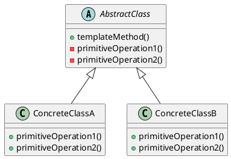
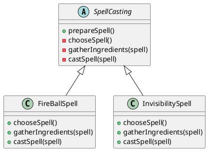

# Template Method

## Intenção
O padrão **Template Method** tem como intenção definir o esqueleto de um algoritmo em uma superclasse, delegando a implementação de passos específicos às subclasses. Isso permite que o comportamento de certos passos seja modificado sem alterar a estrutura global do algoritmo. Ao isolar as partes variáveis das fixas, esse padrão promove a reutilização de código, facilita a manutenção e torna o sistema mais flexível à extensão de comportamento.

## Também conhecido como
- Método Template
- Template Pattern

## Motivação
A motivação para o uso do Template Method está na necessidade de evitar a duplicação de código e promover a reutilização, ao mesmo tempo em que se permite a variação de partes do algoritmo em subclasses.

O padrão *Template Method* em Java define os passos principais em uma classe pai, permitindo que as classes filhas personalizem as implementações específicas. Isso melhora a reutilização de código e a flexibilidade do design na programação Java.

Uma analogia do mundo real pode ser vista no preparo de uma xícara de chá ou café. O processo geral (algoritmo) é o mesmo: ferver a água, preparar a bebida, servir na xícara e adicionar condimentos. No entanto, os passos específicos para preparar a bebida variam. Para o chá, você deixa as folhas em infusão na água quente, enquanto para o café, você coa os grãos moídos. O *Template Method* encapsula os passos invariáveis do processo (ferver a água, servir, adicionar condimentos) em uma classe base, permitindo que subclasses definam os passos específicos da preparação, garantindo assim uma estrutura consistente para a preparação da bebida quente, mas com personalização onde for necessário.

## Estrutura


- **Classe Abstrata:** Define o método `templateMethod()` que orquestra os passos do algoritmo.
- **Métodos Abstratos:** Devem ser implementados por cada subclasse, permitindo variações de comportamento específicas.
- **Métodos com Implementação Padrão:** Podem ser definidos na superclasse e sobrescritos pelas subclasses se necessário.
- **Hooks:** Métodos opcionais com implementação vazia, usados como pontos de extensão sem forçar a sobrescrita.

## Participantes
- **AbstractClass (Template):** Define a estrutura do algoritmo e declara as operações primitivas que precisam ser implementadas nas subclasses.
- **ConcreteClass:** Implementa os passos específicos do algoritmo definidos como operações primitivas na classe abstrata.

## Colaborações
A classe abstrata centraliza a estrutura do algoritmo e delega os passos específicos para as subclasses por meio de métodos abstratos ou *hooks*. Isso permite que o fluxo geral permaneça inalterado, ao mesmo tempo que comportamentos específicos possam variar.

## Consequências
**Benefícios:**
- Promove reutilização de código ao isolar o comportamento comum em uma superclasse.
- Permite variação do comportamento em pontos bem definidos.
- Facilita manutenção e extensão do sistema.

**Desvantagens:**
- Pode resultar em uma hierarquia grande de classes, aumentando a complexidade.
- Reduz a flexibilidade, pois a estrutura geral do algoritmo é fixa.
- Requer um design cuidadoso para garantir que os passos definidos como abstratos sejam relevantes e úteis para todas as subclasses.

## Implementação
Para implementar o padrão Template Method, siga estes passos:

1. **Analise o algoritmo** e identifique quais partes são comuns e quais variam.
2. **Crie a classe abstrata**, definindo nela o método template com a ordem dos passos.
3. **Declare métodos abstratos** para os passos variáveis.
4. **Implemente métodos com comportamento padrão**, se aplicável.
5. **Desenvolva as subclasses**, sobrescrevendo os métodos abstratos conforme necessário.

## Exemplo de código
Nosso exemplo prático é sobre conjuração de magias. Os passos gerais conjurar uma magia de acordo com D&D, são: primeiro, juntar os ingredientes da magia, depois proferir as palavras necessárias, e por fim, conjurar a magia. Há várias maneiras de implementar isso.
Vamos primeiro apresentar a classe do *template method* `SpellCasting`, junto com suas implementações concretas `FireBallSpell` e `InvisibilitySpell`. Afim de garantir que as subclasses não sobrescrevam o método template, ele (neste caso o método `prepareSpell`) deve ser declarado como `final`, caso contrário, a estrutura definida na classe base poderia ser sobrescrita pelas subclasses.
```java
public abstract class SpellCasting {

  protected abstract String chooseSpell();
  
  protected abstract void gatherIngredients(String spell);
  
  protected abstract void castSpell(String spell);

  public final void prepareSpell() {
    String spell = chooseSpell();
    System.out.println("Magia escolhida: " + spell + ".");
    gatherIngredients(spell);
    castSpell(spell);
  }
}
```
```java
public class FireBallSpell extends SpellCasting {

    @Override
    protected String chooseSpell() {
      return "Bola de Fogo";
    }
  
    @Override
    protected void gatherIngredients(String spell) {
      System.out.println("Reunindo um pouco de guano de morcego e enxofre para " + spell + ".");
    }
  
    @Override
    protected void castSpell(String spell) {
      System.out.println("Pelas chamas ancestrais que moldaram o mundo, eu invoco o fogo primordial! Queime tudo em seu caminho," + spell + "!");
    }
  }
```

```java
public class InvisibilitySpell extends SpellCasting {

    @Override
    protected String chooseSpell() {
        return "Invisibilidade";
    }

    @Override
    protected void gatherIngredients(String spell) {
        System.out.println("Coletando cílio preso em goma arábica para conjurar  " + spell + ".");
    }

    @Override
    protected void castSpell(String spell) {
        System.out.println("Pelas sombras que ocultam o mundo, envolvo esta essência em véus de ilusão. " + spell + "!");
    }
}
```

Agora, a classe do mago da raça Kobold contendo o *template method*:

```java
public class MageKobold {

    private SpellCasting spellCastingMethod;

    public MageKobold(SpellCasting spellCastingMethod) {
        this.spellCastingMethod = spellCastingMethod;
    }

    public void prepareSpell() {
        spellCastingMethod.prepareSpell();
    }

    public void changespellCastingMethod(SpellCasting spellCastingMethod) {
        this.spellCastingMethod = spellCastingMethod;
    }

    public static void main(String[] args) {
        var mage = new MageKobold(new FireBallSpell());
        mage.prepareSpell();
        mage.changespellCastingMethod(new InvisibilitySpell());
        mage.prepareSpell();
    }

}
```

```java
public static void main(String[] args) {
        var mage = new MageKobold(new FireBallSpell());
        mage.prepareSpell();
        mage.changespellCastingMethod(new InvisibilitySpell());
        mage.prepareSpell();
}
```

```cmd
Magia escolhida: Bola de Fogo.
Reunindo um pouco de guano de morcego e enxofre para Bola de Fogo.
Pelas chamas ancestrais que moldaram o mundo, eu invoco o fogo primordial! Queime tudo em seu caminho,Bola de Fogo!
Magia escolhida: Invisibilidade.
Coletando cílio preso em goma arábica para conjurar  Invisibilidade.
Pelas sombras que ocultam o mundo, envolvo esta essência em véus de ilusão. Invisibilidade!
```

## Estrutura exemplo de código


Nesse caso, o SpellCasting atua sendo a **classe abstrata**, servindo como um "Template" para a criação de duas outras spells: FireBallSpell e InvisibilitySpell.

## Usos conhecidos
- Frameworks de interface gráfica (GUI) que definem o fluxo de renderização e permitem que subclasses personalizem partes como layout ou desenho.
- Classes base em jogos que definem a lógica principal de turno e permitem que subclasses personalizem ações.
- Processos de manipulação de arquivos, como leitura, transformação e salvamento.

## Padrões relacionados
- **Factory Method:** Pode ser usado em conjunto com Template Method para criar objetos necessários nos passos do algoritmo.
- **Strategy:** Enquanto o Template Method usa herança para definir os passos do algoritmo (configuração estática), o Strategy utiliza composição, permitindo a troca de algoritmos em tempo de execução (configuração dinâmica).

## Referências

### Livros
- **Kerievsky, Joshua.** *Refactoring to Patterns.* Addison-Wesley Professional, 5 de agosto de 2004. ISBN: 978-0321213358.

- **Freeman, Eric; Robson, Elisabeth.** *Head First Design Patterns: Building Extensible and Maintainable Object-Oriented Software.* 2ª edição, O'Reilly Media, 2020. ISBN: 978-1492077992.

- **Bloch, Joshua.** *Effective Java.* 3ª edição, Addison-Wesley Professional, 27 de dezembro de 2017. ISBN: 978-0134685991.

- **Gamma, Erich; Helm, Richard; Johnson, Ralph; Vlissides, John.** *Design Patterns: Elements of Reusable Object-Oriented Software.* Addison-Wesley Professional, 31 de outubro de 1994. ISBN: 978-0201633610.

### Sites
- [Template Method Design Pattern in Java | GeeksforGeeks](https://www.geeksforgeeks.org/template-method-design-pattern-in-java)
- [Template method pattern - CodeDocs](https://codedocs.org/what-is/template-method-pattern)
